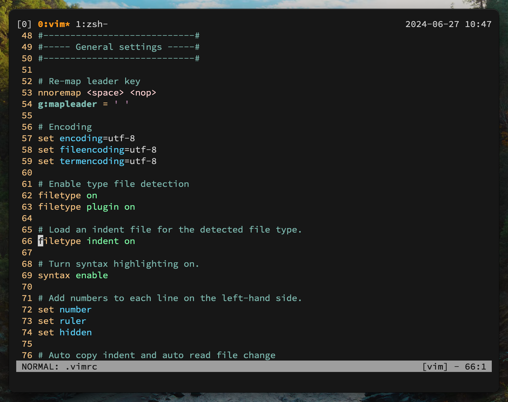

# dotfiles
NOTED: These are my personal configuration files, which could be changed as I develop my environment on macOS.

## Showcase


## Installation
Clone repository to your local device and `cd` into it:
```shell script
$ git clone https://github.com/khoanduy/dotfiles.git
$ cd dotfiles
```
Then run the setup script (you have to run `chmod +x` in able to execute it):
```shell script
$ chmod +x configure-tilde
$ ./configure-tilde
```
This might take quite a while as it needs to download and install several tools.

After script execution finish, reload your `zsh` config file:
```shell script
$ source ~/.zshrc
```

Launch `vim`, ignore all errors and install all plugins by execute:
```vim
:PlugInstall
```
With `neovim`, just need wait for `Lazy` installs all plugins.

## Additional options
For Helix user, you might want to install essential LSP and DAP for specific language 
by following this [guide](https://github.com/helix-editor/helix/wiki/How-to-install-the-default-language-servers).

## References
[tmux](https://github.com/tmux/tmux)\
[neovim](https://neovim.io/doc/user/index.html)
