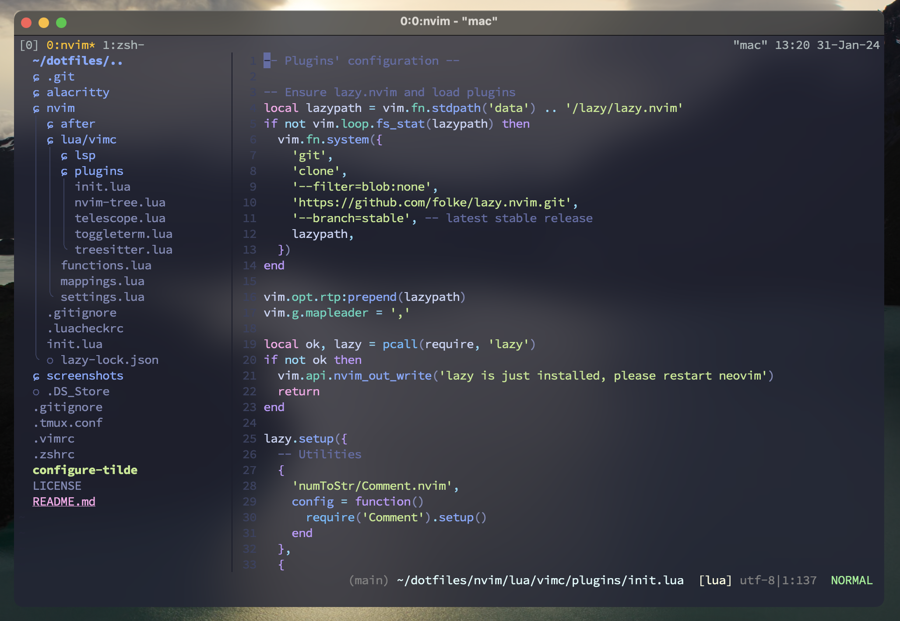

# dotfiles
NOTED: These are my personal configuration files, which could be changed as I develop my environment across multiple systems.

## Showcase


## Installation
Clone repository to your local device and `cd` into it:
```shell script
$ git clone https://github.com/khoanduy/dotfiles.git
$ cd dotfiles
```
Then run the setup script (you have to run `chmod +x` in able to execute it):
```shell script
$ chmod +x configure-tilde
$ ./configure-tilde
```
This might take quite a while as it needs to download and install several tools.

After script execution finish, reload your `zsh` config file:
```shell script
$ source ~/.zshrc
```

Open `neovim` and wait for `Lazy` installs all plugins, or you might need to run it manually
```vim
:Lazy
```

## Additional options
You might want to install these packages if they are not there yet:
1. [Alacritty](https://github.com/alacritty/alacritty)
2. [Lazygit](https://github.com/jesseduffield/lazygit)

## References
[tmux](https://github.com/tmux/tmux)\
[neovim](https://neovim.io/doc/user/index.html)
